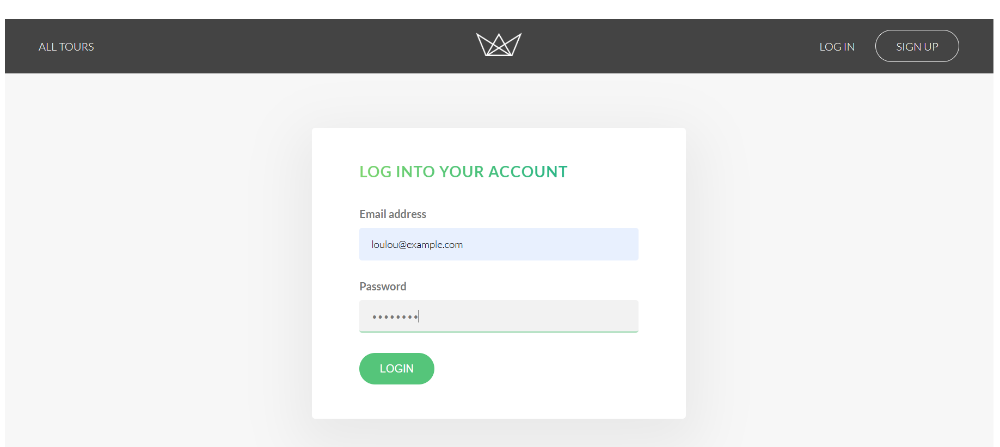
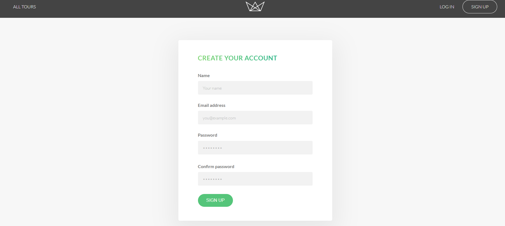
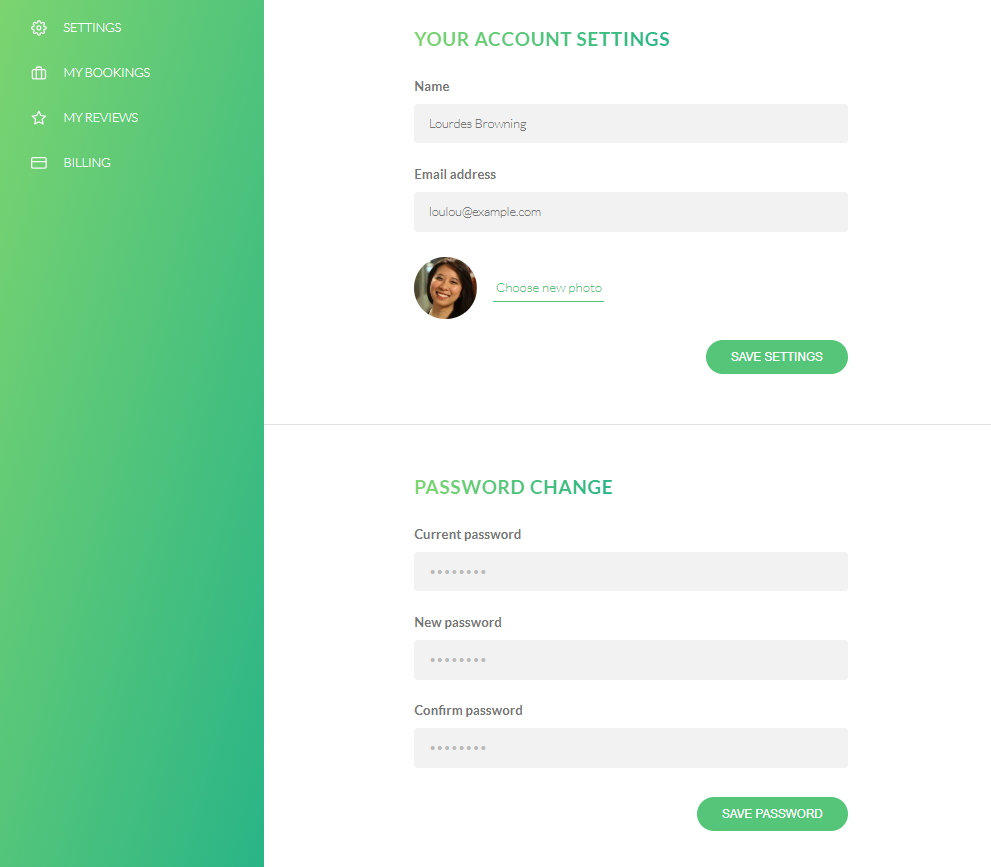

# TravelHub

TravelHub is a full-stack tour booking application where users can browse tours, view tour details, sign up, log in, manage account settings, write reviews, and complete bookings using Stripe checkout.

## Live Demo

https://travelhub-api.vercel.app

## Demonstration

### Home Page


https://github.com/user-attachments/assets/28a87341-d3cb-49b9-b999-f7247bcd8dd9


### Tour Details & Booking Flow


> The booking demo shows the tour details page and Stripe checkout flow using test mode.

## Screenshots

### Login Page



### Sign Up Page



### Account Settings



## Features

- User signup, login, and logout
- JWT authentication with secure cookies
- Tour listing and tour details pages
- User account settings
- Password update
- Review system
- Stripe checkout integration
- MongoDB/Mongoose data models
- Server-side rendering with Pug templates
- Security middleware: rate limiting, sanitization, HPP, and Helmet
- Deployed on Vercel

## Tech Stack

- Node.js
- Express
- MongoDB
- Mongoose
- Pug
- Axios
- Stripe
- JWT
- Vercel

## Demo Login

You can test the app using this demo account:

```txt
Email: laura@example.com
Password: test1234
